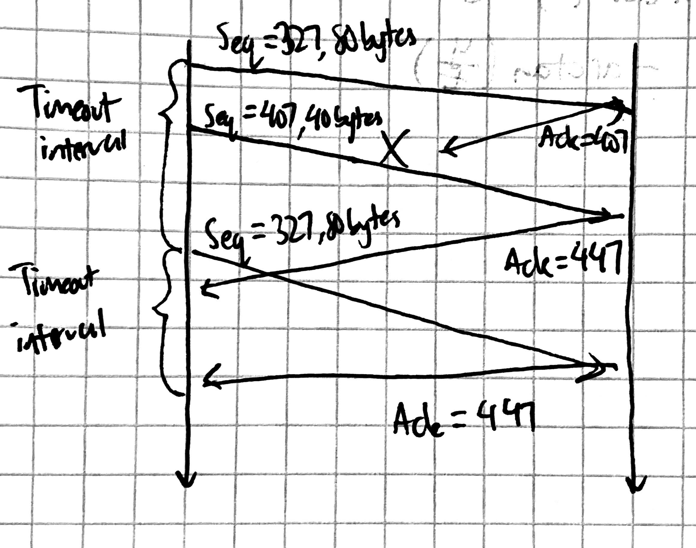

# CS118 Homework 4

Prithvi Kannan
UID: 405110096

## Problem 1

a. sequence number: $326+80+1=407$
source port number: $40200$
dest port number: $80$

b. ack number: $407$
source port number: $80$
dest port number: $40200$

c. ack number: $327$

d.

## Problem 2

a. The required buffer size for GBN is 1 and 23 for SR.

b.  

i. SeqNumSize $= (N+M) = 6+3=9$

ii. SeqNumSize $= (N+1) = 6+1 =7$

## Problem 3
after the 106ms sample...
- estRTT=$(1-.125)(100)+(0.125)(106)=100.75$
- devRTT=$(1-.25)(5)+(0.25)|106-100.75|=5.06$
- timeout=$100.75+4*5.06=120.99$

after the 120ms sample...
- estRTT=$(1-.125)(100.75)+(0.125)(120)=103.15$
- devRTT=$(1-.25)(5.06)+(0.25)|120-103.15|=8.00$
- timeout=$103.15+4*8=135.15$

after the 150ms sample...
- estRTT=$(1-.125)(103.15)+(0.125)(150)=109.00$
- devRTT=$(1-.25)(8)+(0.25)|150-109|=14.62$
- timeout=$109+4*14.62=167.50$

## Problem 4

a. 

Go-Back-N: 15 total segments. Initially send 10 segments, then resend 6-10 so 15 total segments. B will send 14 ACKs. 5 ACKs will be sequence number 1 and the other 9 acks will be 2,3,4,...,10.

Selective-Repeat: 11 total segments. Initially send 10 segments, then resend segment 6. B will send 10 ACKs with sequence numbers 1,2,3,...,10.

TCP: 11 total segments. Initially send 10 segments, then resend segment 6. B will send 10 ACKs, 4 of which have sequence number 6, and the remainder have 2,3,4,5,10,11.

b. If the timeouts are very long, then TCP will be the quickest protocol to deliver all 10 segments successfully, since the fast retransmit doesn't require waiting for time out.

## Problem 5

a. HTTP does not use any timers directly, but uses the TCP timers.

b. DNS uses timers in the form of time to live (TTL) values, which is essentially an expiry date for a DNS record. Once that TTL has run out, then the record can be cleared from the cache. DNS communication is built on UDP, which does not use any timers.

c. TCP uses a retransmission/timeout timer for managing acknowledgements. TCP also uses a timer for congestion management.

d. UDP does not use timers because retransmission methods are written at the application layer instead. 