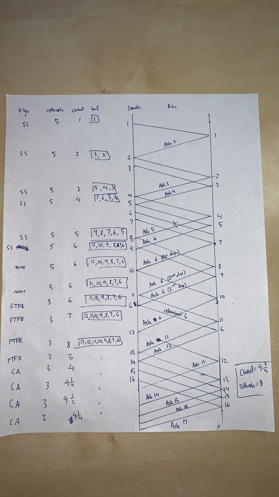

# CS118 Homework 5

Prithvi Kannan
UID: 405110096

## Problem 1

Since A is sending data faster than B can remove it, the reciever buffer will fill up. When the buffer is full, B will tell A to stop sending data until B can clear space in the buffer. Once B is ready to recieve more data, it sends a segment to A. A will then send data (likely filling the buffer again) until all data has been sent from A to B. 

## Problem 2

s port: 5670

d port: 2008

seq_no: 3120

ack_no: 981

control bits (all 6 bits): 010001

## Problem 3

a. 

$LossRate = W/2 + (W/2 +1) + L + W$

$= \sum_{n=0}^{W/2}(W/2+n)$

$=(W/2 +1)W/2+\sum_{n=0}^{W/2}{n}$

$=(W/2 +1)W/2+\frac{W/2(W/2+1)}{2}$

$=W^2/4 +W/2+W^2/8+W/4$

$LossRate =3W^2/8 +3W/4$

b. For large W, $3W^2/8 >> 3W/4$ so $L\approx \frac{8}{3W^2}$

$W=\sqrt{\frac{8}{3L}}$

$avgRate = 3/4 * W/RTT = 3/4*\sqrt{\frac{8}{3L}} \frac{MSS}{RTT} = 1.22 \frac{MSS}{RTT*\sqrt{L}}$

## Problem 4

a. To fully use the network, the `rwnd` must be larger than $delay*bandwidth$.

$delay=\frac{800Mb}{s}*\frac{10^6b}{1 Mb}*\frac{1 s}{10^3ms} = 8*10^5 b/ms$

$RecieveWindow \geq 8*10^5 b/ms * 400ms = 3.2*10^8 b = 40MB$

$bits=log_2(40MB)=26$ for RecieveWindow

$SequenceNum \geq maxLifetime * bandwidth = 25s * 800Mbps = 20Gbit = 2.5GB$

$bits=log_2(2.5GB)=32$ for SequenceNum

b. If RecieveWindow of 16 bits then it would be smaller than $delay * bandwidth$

$effective = RecieveWindow/RTT = 2^{16}B/400ms = 163.84 KB/s$

## Problem 5

